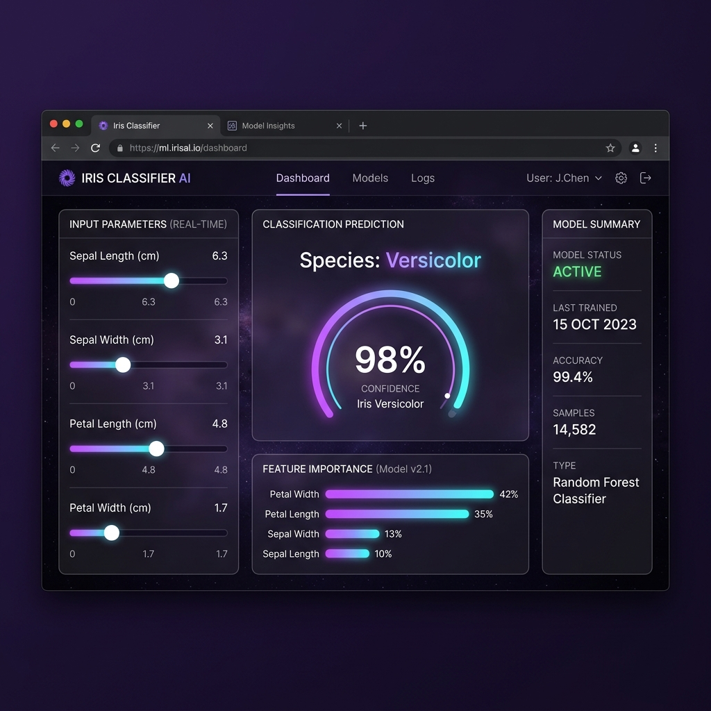

# Data Classification Using AI - Iris Species Predictor

An elegant, production-ready machine learning classification web application that predicts the species of an Iris flower based on physical measurements:
- **Sepal Length** (cm)
- **Sepal Width** (cm)
- **Petal Length** (cm)
- **Petal Width** (cm)

The system features a **Decision Tree Classifier** trained using `scikit-learn` on the Iris dataset, wrapped in a **Python Flask** backend, paired with a gorgeous, high-end **glassmorphic interactive dashboard** UI supporting live sliders, numerical syncing, quick test presets, dark/light theme toggles, and Chart.js animations.

### 🖥️ Dashboard UI Preview



---

## 🌟 Key Features

1. **Precision ML Engine**:
   - Built with `scikit-learn` using a Decision Tree Classifier (`max_depth=4` to avoid overfitting).
   - Stratified `80/20` train/test split.
   - Comprehensive model validation: Accuracy, Precision, Recall, F1-Score, and a heatmapped Confusion Matrix.
   - Real-time prediction confidence score (probability distribution).

2. **Premium Tech Design UI**:
   - Modern glassmorphic aesthetic built using Vanilla CSS custom properties.
   - Elegant dark mode (deep space theme) and clean light mode (indigo slate theme) with local persistence.
   - Live range-slider and number-input synchronization for real-time value validation.
   - Single-click **Test Samples** for easy validation of each Iris species (Setosa, Versicolor, Virginica).
   - Dynamic SVG confidence progress ring and color-coded probability bars.

3. **Dynamic Visual Analytics**:
   - **Feature Importance**: Animated horizontal bar chart using Chart.js demonstrating which physical characteristics are most influential to the model's decision making.
   - **Confusion Matrix**: A custom CSS heatmapped matrix representing the actual vs. predicted classifications on the 20% validation set.
   - **Dataset Statistics**: Training set summary displaying min, max, mean, and standard deviations for all physical parameters.

---

## 📁 Project Directory Structure

```
project/
├── app.py                  # Core Flask server and API endpoints
├── model.py                # Wrapper class to load model.pkl and handle inference
├── train_model.py          # Standalone training script for ML pipeline
├── model.pkl               # Trained serialization of DecisionTreeClassifier
├── model_metadata.json     # Evaluation metrics, dataset statistics, and importances
├── requirements.txt        # Python package dependencies
├── README.md               # Extensive project documentation (this file)
├── templates/
│   └── index.html          # Main HTML5 semantic structure
└── static/
    ├── style.css           # Premium glassmorphic styles with Dark/Light vars
    └── script.js           # Frontend interactive logic and API fetching
```

---

## ⚙️ Installation & Setup Guide

### Prerequisites
- **Python 3.8+** installed.
- **pip** (Python package installer).

### Step-by-Step Instructions

1. **Open Workspace Directory**:
   Navigate to the project root directory:
   ```bash
   cd "c:\Users\garvi\Documents\Data Science Projects\Data Classification Using AI"
   ```

2. **Create Python Virtual Environment**:
   Isolate project dependencies by creating a local virtual environment:
   ```bash
   python -m venv .venv
   ```

3. **Activate the Virtual Environment**:
   - **Windows PowerShell**:
     ```powershell
     .venv\Scripts\Activate.ps1
     ```
   - **Windows Command Prompt**:
     ```cmd
     .venv\Scripts\activate.bat
     ```
   - **macOS / Linux**:
     ```bash
     source .venv/bin/activate
     ```

4. **Install Dependencies**:
   Install pandas, numpy, scikit-learn, Flask, and Flask-CORS:
   ```bash
   pip install -r requirements.txt
   ```

5. **Train the Classifier Model**:
   Run the training pipeline to generate the serialized model and metadata JSON file:
   ```bash
   python train_model.py
   ```
   *Expected Output:*
   ```text
   Loading Iris dataset...
   Dataset split: 120 training samples, 30 testing samples.
   Training Accuracy: 0.9917
   Testing Accuracy: 0.9333
   Trained model successfully saved to 'model.pkl'
   Model metadata successfully saved to 'model_metadata.json'
   ```

6. **Launch the Flask Server**:
   Start the web application locally:
   ```bash
   python app.py
   ```
   *Expected Output:*
   ```text
    * Serving Flask app 'app'
    * Debug mode: on
    * Running on http://127.0.0.1:5000
   ```

7. **Access the Web App**:
   Open your browser and navigate to: **[http://127.0.0.1:5000](http://127.0.0.1:5000)**

---

## 🔌 API Documentation

The server exposes the following RESTful API endpoints:

### 1. Model Inference
- **Endpoint**: `/api/predict`
- **Method**: `POST`
- **Headers**: `Content-Type: application/json`
- **Payload Example**:
  ```json
  {
    "sepal_length": 6.1,
    "sepal_width": 2.8,
    "petal_length": 4.7,
    "petal_width": 1.2
  }
  ```
- **Response Success (200 OK)**:
  ```json
  {
    "success": true,
    "species": "Versicolor",
    "confidence": 0.9091,
    "probabilities": {
      "setosa": 0.0,
      "versicolor": 0.9091,
      "virginica": 0.0909
    }
  }
  ```
- **Response Error (400 Bad Request)**:
  ```json
  {
    "success": false,
    "error": "Sepal Width must be a positive number greater than 0."
  }
  ```

### 2. Retrieve Model Performance Diagnostics
- **Endpoint**: `/api/model-info`
- **Method**: `GET`
- **Response Success (200 OK)**:
  Contains accuracy, train/test samples distribution, target class names, feature importance percentages, raw 3x3 confusion matrix grid, classification metrics, and dataset statistics.

---

## 🧠 Machine Learning Methodology

- **Decision Tree Classifier**: The classifier recursively splits data based on feature thresholds that maximize **Gini Impurity** reduction.
- **Stratified Split**: Keeps the exact same percentage of each species in the training set (80%) and validation set (20%) to prevent bias.
- **Preventing Overfitting**: By setting a maximum depth constraint of 4, the model learns generalized shapes instead of memorizing training instances.
- **Inference Probabilities**: Determined by calculating the percentage of training samples from each target species that landed in the terminal leaf node of the decision tree corresponding to the inputs.
